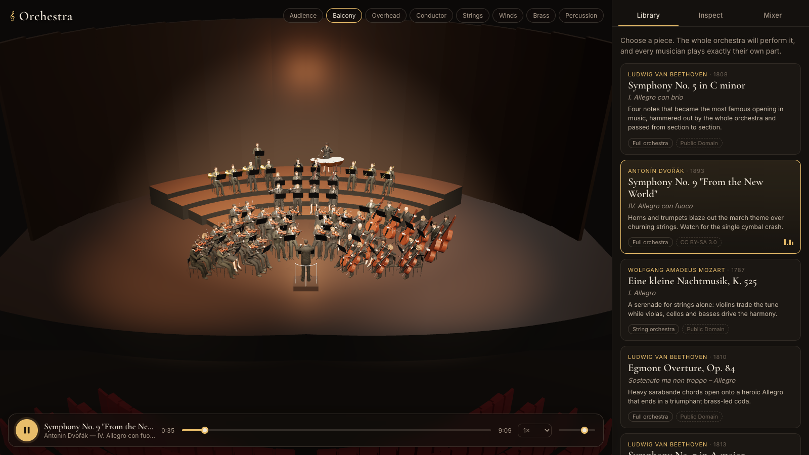

# Orchestra: a 3D symphony simulator

This app shows a full symphony orchestra performing the classical piece you pick from the library on the right. Every musician animates from their own part in the score:

- string players bow each note, with direction changes, string crossings, vibrato and fingering positions on the neck;
- wind and brass players raise their instruments before an entrance and breathe in the rests;
- trombone slides move with the pitch;
- timpani and percussion strike exactly on the note;
- the conductor beats the score's own tempo map and cues sections as they come in.

Audio is synthesised in the browser from the same MIDI score using sampled instruments, so sound and motion share one clock.



## Run it

```sh
pnpm install
pnpm dev            # http://localhost:5173
```

Pick a piece in the **Library** tab and it starts playing.

**Controls**

| Input | Action |
|---|---|
| Drag / scroll / right-drag | Orbit / zoom / pan |
| Camera chips | Audience, balcony, overhead, conductor view, or a section close-up |
| Click a musician | Fly the camera to them and follow them |
| `Space` | Play / pause |
| `←` / `→` | Seek 5 seconds |
| `Esc` | Deselect |

**Inspecting a musician** (the **Musician** tab) shows the notes sounding now, a dynamics meter and a scrolling piano roll of their part. From there you can **solo**, **mute** or **highlight** their section. The **Mixer** tab does the same for every section at once.

**Import MIDI** (the drop zone at the bottom of the library) plays any orchestral `.mid` file you own. Tracks are mapped to sections by track name (English, Italian or German) and General MIDI program. The file never leaves your browser.

## Default library

All scores come from [The Mutopia Project](https://www.mutopiaproject.org) and are free to redistribute. Download them with `pnpm music:fetch`; they are already in `public/music`.

| Piece | License |
|---|---|
| Beethoven, Symphony No. 5 / I | Public domain |
| Beethoven, Symphony No. 7 / II | Public domain |
| Beethoven, Egmont Overture | Public domain |
| Beethoven, Coriolan Overture | Public domain |
| Dvořák, Symphony No. 9 / IV | CC BY-SA 3.0 (Keith OHara) |
| Mozart, Eine kleine Nachtmusik / I | Public domain |
| Rossini, *Eduardo e Cristina* overture | Public domain |

Track-to-section fixes for these files, such as horns mislabelled as General MIDI "english horn", live in `public/music/library.json` under `trackOverrides`.

## How it works

```
MIDI ──► Score (parts, beat grid, loudness) ──► Plans (bowing, raises, sticking, beats)
  │                                                     │
  └──► AudioEngine (smplr samples, section mute/solo) ◄─┴── Transport clock (AudioContext time)
                                                        │
                        Actors (rig + instrument + performer) ◄── song time every frame
```

| Area | Files | What it does |
|---|---|---|
| Score | `src/music/*` | Parses MIDI and maps tracks to sections. Builds the conducted beat grid and per-part loudness (velocity × CC7 × CC11). Dynamics are inferred when a file has none. `NoteIndex` answers "what is sounding at t" in O(log n). |
| Audio | `src/audio/*` | `smplr` sampled instruments are scheduled on AudioContext time with a lookahead feeder. The graph is part gate → expression → section gain (mute/solo) → pan → reverb. `getOutputTimestamp()` compensates output latency so visuals match what you hear. If there is no audio device, playback falls back to a silent wall-clock mode. |
| Orchestra | `src/orchestra/*` | American seating with risers, desks and stands. Assigns players to parts, including divisi (outside player takes the top voice) and shared staves (basses read the cello part). |
| Animation | `src/animation/*` | Every performance is a pure function of song time, so seeking and scrubbing just work. Plans are precomputed at load. `Actor` poses a character with bind-pose-agnostic two-bone IK (`src/rig/`) onto anchors on the instrument. |
| Assets | `src/assets/*` | Realistic characters and instruments load from GLBs when present. Otherwise the app falls back to procedural placeholders that use the same skeleton and anchor contract. |

## Realistic assets (Blender pipeline)

- **Musicians** are Microsoft Rocketbox avatars (MIT), converted headless with Blender. The conversion fixes units, orientation and textures, recolours outfits to concert black and generates LODs:
  ```sh
  brew install --cask blender
  tools/blender/build_characters.sh
  ```
  See `tools/blender/README.md`.
- **Instruments** are modelled procedurally with Blender Python in `tools/blender/instruments/`, plus a validator. Each exported GLB keeps exactly the anchor positions the animation code uses; the contract is `tools/blender/instruments/anchor_contract.json`, regenerated with `DUMP_ANCHORS=1 pnpm test`. The app swaps a realistic mesh in for any instrument listed in `public/assets/instruments/instruments.json`.

## Tests

```sh
pnpm test      # unit tests (vitest): MIDI mapping on the real library, note index, beat grid, seating, bowing/sticking plans, IK
pnpm e2e       # Playwright: load a piece, play, seek, inspect, solo/highlight, click-to-select in 3D
```

## Credits

See the in-app **Credits & licenses** panel and `CREDITS.md`.
